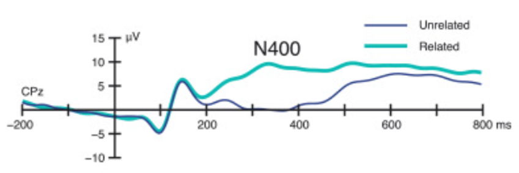
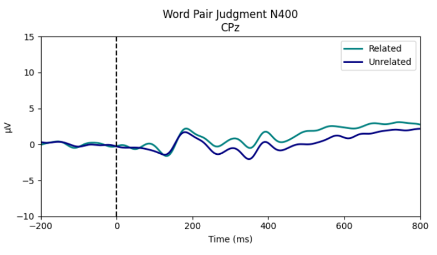

<!-- This is an html comment and this won't appear in the rendered page. You are now editing the "content" area, the core of your description. Everything that you can do in markdown is allowed below. We added a couple of comments to guide your through documenting your progress. -->

## Project definition

### Background

As someone without much programming background and no prior experience with EEG experiments, I took on this project to gain hands-on experience working with raw EEG data — and to learn how to extract ERP components like the N400, which we often see in published studies.
The goal of the project was to use MNE-Python, the EEG analysis tool introduced in our course module. While the module provides a basic demonstration, it only covers some of the core steps. I wanted to understand the full pipeline, from raw data all the way through preprocessing.

### Tools

MNE-Python
[The data preprocessing workflow from NeuralDataScience](https://neuraldatascience.io/7-eeg/introduction.html)

### Data

[ERP CORE: N400](https://erpinfo.org/erp-core)

[EEGLAB (Matlab) working pipline](https://github.com/mckuoling/ERP_CORE/tree/master/N400%20Analysis%20Files/N400/EEG_ERP_Processing)

### Key Changes

Since this project aimed to replicate the N400 results from the ERP CORE dataset, most preprocessing steps and filter parameters followed the original EEGLAB (MATLAB-based) script closely.

One notable adjustment was in the handling of Independent Component Analysis (ICA). As the original authors noted, ICA is a algorithm that the results may vary with each run. In their MATLAB pipeline, the authors documented the specific ICA components that should be removed in order to replicate their original N400 results.

However, since this implementation was done in MNE-Python rather than MATLAB, I adopted an alternative approach based on the [NeuroDataScience tutorial](https://neuraldatascience.io/7-eeg/erp_preprocessing.html#). Specifically, I used the `find_bads_eog()` method to automatically identify and remove EOG-related components. This allows for a more reproducible and automated workflow:

```python
eog_inds, eog_scores = ica.find_bads_eog(raw, threshold=3.0)
print(f"Subject {subject_id} EOG-like ICA components:", eog_inds)
```

## Results

This is the N400 example produced by ERP CORE:
  
(Kappenman et al, 2021)

And this is the N400 I generated using the same dataset, after adapting the original MATLAB pipeline to MNE-Python.



## Conclusion and acknowledgement

I am very grateful for this course, which allowed me to learn data science in a completely new way. It helped me understand how to learn independently and find solutions. The course also introduced various tools that are commonly used in data science, which is a crucial foundation for beginners.

I also sincerely appreciate the instructors and classmates of this course. Seeing my classmates’ presentations made me realize I’m not alone—facing failures and struggles between different tools and errors is completely normal. I’m also very thankful for the teachers’ continuous encouragement, acknowledging what we have accomplished and pointing out the reasons behind our difficulties. It made me feel very supported and warm.

In this fast-changing era, we can no longer rely solely on teachers to explain everything in class. Making good use of available resources and continuously learning on our own is essential to sustain progress in this field.
